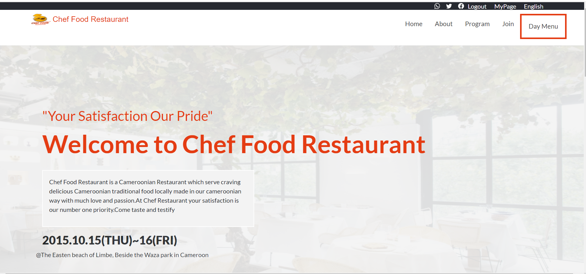

# First Capstone Project: Responsive Restaurant Website

> This is my capstone project on HTML-CSS-JAVASCRIPT. I love restaurants so I have developed this project along that line. The website is about a traditional restuarant called Chef Food Restaurant. It features a list of dishes, an about page and partner sections. Please have a look at the live demo and let me know what you think 😊.

## Learning Objectives 🔖

- [x] Use semantic HTML tags.
- [x] Apply best practices in HTML code.
- [x] Use CSS selectors correctly.
- [x] Use CSS box model.
- [x] Use Flexbox to place elements in the page.
- [x] Demonstrate ability to create UIs
- [x] adaptable to different screen sizes using media queries.
- [x] Use GitHub Pages to deploy web pages.
- [x] Apply JavaScript best practices and language style guides in code.
- [x] Use JavaScript to manipulate DOM elements.
- [x] Use JavaScript events.
- [x] Use objects to store and access data.
- [x] Communicate technical concepts to other technical people.

## Built With 🛠️

- [x] HTML, CSS and JavaScript
- [x] Linters: Lighthouse, Webhint, Stylelint and ESlint
- [x] Code Editor: VS Code

# Here is a link to my loom video
 https://www.loom.com/share/bd34d64035c24a82bc542e76cce80163

## Live Demo 🔗

[Live Demo Link](https://christabelle143.github.io/Capstone1/)👈

## Website Mockup 📱 💻 🖥️

## Getting Started
To get a local copy up and running follow these simple example steps.

- Create a local directory that you want to clone the repository.

- Open the command prompt in the created directory.

- On the terminal run this command git clone git@github.com:Christabelle143/Capstone1.git.

- Go to the repository folder using command prompt cd javascript-capstone.

- Install the dev dependencies for linters run npm install.

## Author

👤 **Author**

- GitHub: Christabelle143[https://github.com/Christabelle143]
- Twitter: @christabelleyo[https://twitter.com/@christabelleyo]
- LinkedIn: Youta Lactio Christabelle[https://LinkedIn.com/Youtalactiochristabelle]

## 🤝 Contributing

Contributions, issues, and feature requests are welcome!

## Show your support

Give a ⭐️ if you like this project!

## Acknowledgments
- [Microverse](https://www.microverse.org/)
- [Cindy Shin](https://www.behance.net/gallery/29845175/CC-Global-Summit-2015) from who I got my inspiration.
- A great thanks to My coding partners, morning session team, and standup team Partners for their contributions.
- Thanks to Code Reviewers for the insightful feedback.

## 📝 License

This project is [MIT](./MIT.md) licensed.
